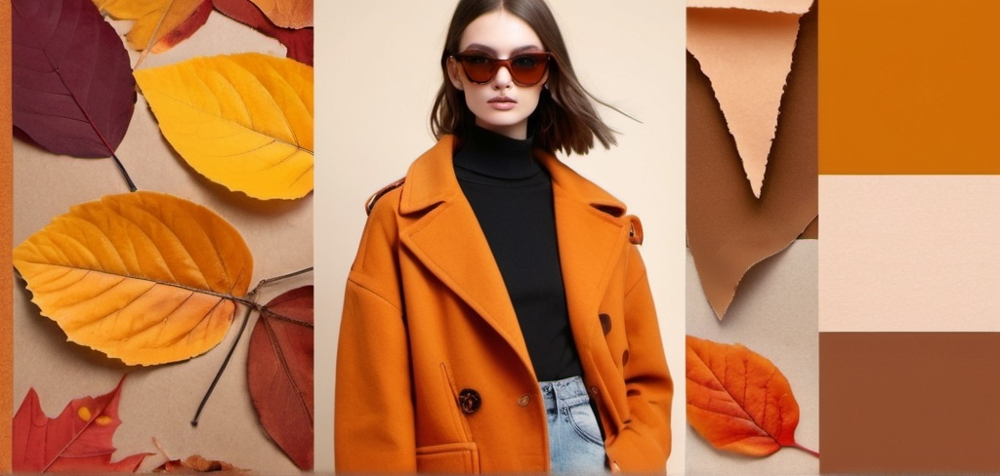
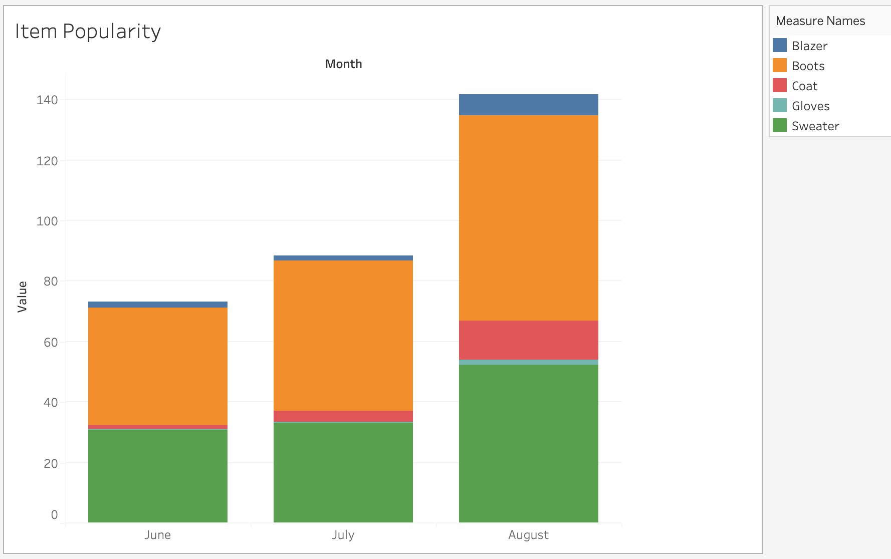
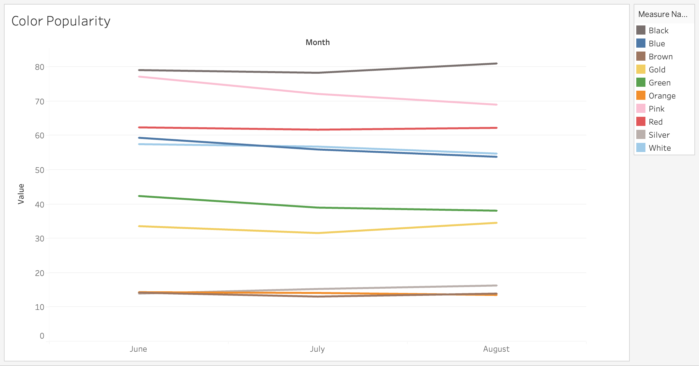
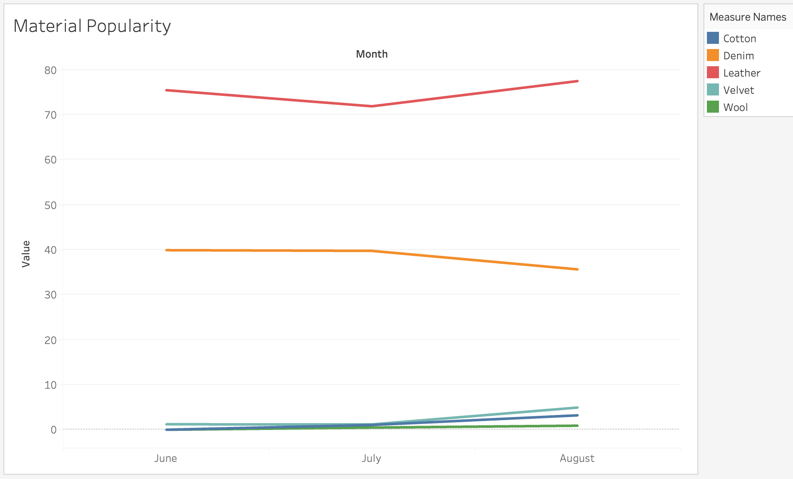
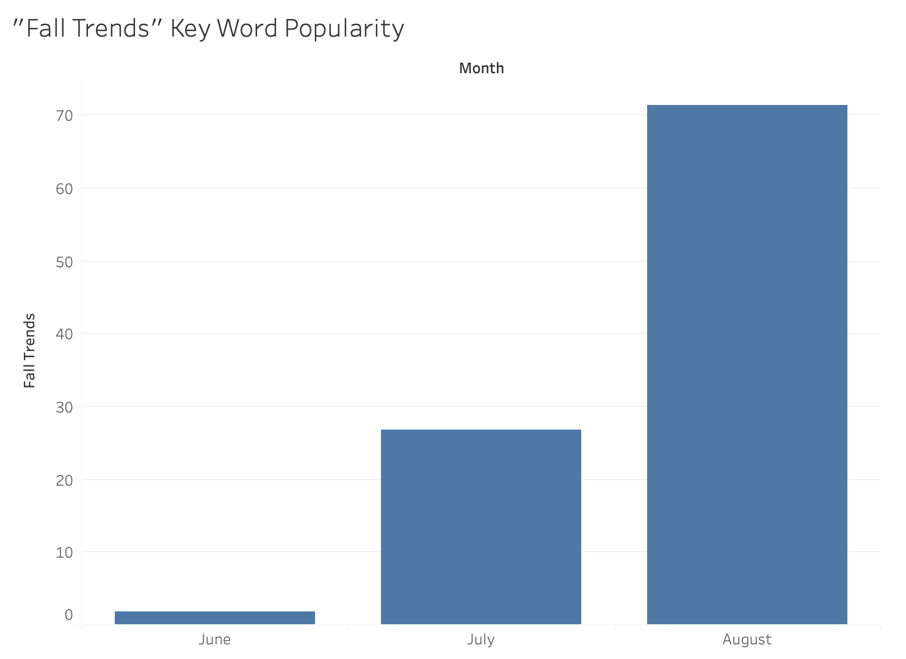

# Fall Fashion Trends 2024 Analysis
## Overview
This project explores the changing popularity of various fashion items, colors, and materials as we approach the fall season. Using data from **Google Trends** via the **Pytrends library**, I analyzed trends in the fashion and beauty category over the last three months. The analysis focuses on identifying which fashion elements are gaining or losing popularity as fall approaches. The trends were visualized using Tableau to identify patterns and insights.

## About Pytrends
Pytrends is a Python library that interfaces with Google Trends, providing easy access to Google’s trending search data. Google Trends doesn't provide the exact number of searches but rather a popularity score for keywords on a scale from 0 to 100. This score represents the relative interest in the keyword over a specified time frame and within a specified geographic location. A score of 100 indicates peak popularity, while a score of 0 means there was insufficient data for the term.

## Project Objectives
✦ **Identify Trends:** Determine the change in popularity of specific fashion items, colors, and materials as the fall season approaches.

✦ **Categorize by Fashion & Beauty:** Conduct searches within the "Fashion & Beauty" category (category code: 185) to ensure relevance.

✦ **Timeframe and Geographic Location:** Analyze data from the last three months in New York City to observe the latest trends.

✦ **Data Aggregation:** Compute the average monthly popularity for each keyword to identify consistent trends.

## Key Insights
### Fashion Items:
Most items show a positive trend as fall approaches.

Boots are the most popular item, while Gloves are less popular but may increase in the winter.

### Colors:
Black dominates in popularity with a positive trend as fall nears.

Pink, despite its previous popularity (likely due to the Barbie trend), shows a negative trend.

Other colors like Gold, Silver, and Brown also show positive trends, although they are generally less popular.

### Materials:
Leather is the most popular and shows a positive trend.

Velvet and Cotton also have positive trends but are not as popular.

Surprisingly, Denim shows a negative trend, though this might change.

### General Trends:
The popularity of the keyword "Fall Trends" in the context of fashion has surged significantly over the past three months, indicating a growing interest as the season approaches.

## File Structure
✦ **data/:** Contains JSON files with exact dates and averaged trend data.

✦ **graphs/:** Includes images of the visualizations created in Tableau.

✦ **trends.ipynb:** The Jupyter Notebook used for data extraction and analysis.

## Conclusion
The analysis provides valuable insights into which fashion trends are likely to gain momentum as we move into the fall season. Monitoring these trends can help in making informed decisions in the fashion industry, whether for marketing, retail stocking, or design purposes.

## Future Work
Extend the analysis to include more categories or keywords.

Monitor trends into the winter season to observe the continuity or reversal of current trends.

Expand the geographical scope of the analysis to compare trends across different regions.
